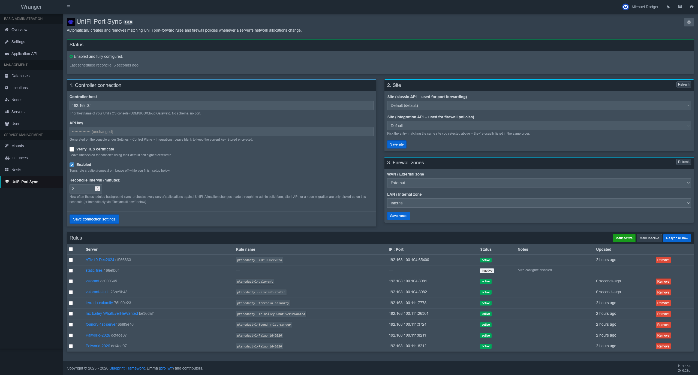
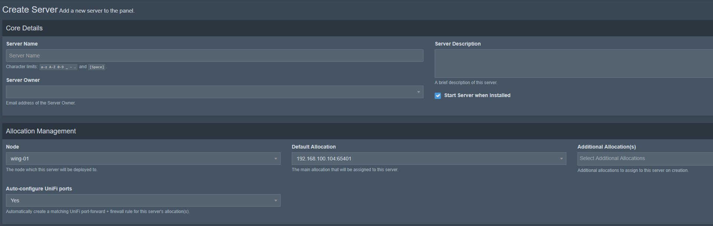
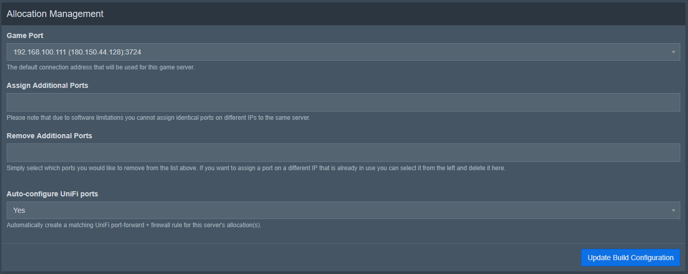

## Note:
**Yes, this entire extension was written with Claude. I don't care if you have strong opinions about AI usage in development. This solved a gap I needed solving and it works well.**

## License

This project is licensed under GPL-3.0 with Commons Clause.

Commercial use, resale, paid hosting, SaaS offerings, and paid support services based on this
software are prohibited without prior written permission from the copyright holder.


# UniFi Port Sync

A [Blueprint](https://blueprint.zip) extension for [Pterodactyl](https://pterodactyl.io) that
automatically keeps UniFi port-forward rules and Zone-Based Firewall policies in sync with your
servers' network allocations.

Assign a server the allocation `192.168.1.10:8000` and this extension creates:

- a UniFi port-forward rule: WAN → `192.168.1.10:8000` (TCP + UDP)
- a UniFi firewall policy allowing that inbound traffic

Both are removed automatically when the allocation is unassigned, the server is deleted, or
auto-configure is turned off for that server (see below).



## How it stays in sync

- **Instant**: a server finishing installation or being deleted fires Pterodactyl events this
  extension listens for directly, as does toggling a server's auto-configure preference (see
  below) — each applies immediately rather than waiting on the schedule.
- **Within ~1 interval (default 2 min, admin-configurable)**: everything else -- allocations
  added/removed through the admin build form or the client API, a primary-allocation change that
  brings in a previously-unassigned allocation, a node migration -- doesn't reliably fire Laravel
  events in Pterodactyl core (confirmed by reading the relevant service classes). A scheduled
  `php artisan unifisync:reconcile` re-derives every server's *actual current* allocations from
  the database and diffs them against UniFi on each tick, so it doesn't matter how or why the
  allocation set changed. This is also what recovers from a transient UniFi API failure, and what
  cleans up rules for servers deleted before this extension was installed.
- **Manual**: the **Resync all now** button on the admin page runs the same reconcile immediately,
  on demand.

Nothing is hardcoded: controller host, API key, site, WAN/LAN zone, and the sync interval are
all set from the extension's admin page. It ships disabled and inert until configured.

## Requirements

- Pterodactyl + [Blueprint](https://blueprint.zip/docs) installed.
- A UniFi OS console (UDM/UCG/Cloud Gateway) running **Zone-Based Firewall**, with a local API
  key generated under **Settings → Control Plane → Integrations**.

## Building / installing

### Option A: install a release (recommended for most users)

Download the latest `unifisync.blueprint` from the
[releases page](https://github.com/michaelkr1/Pterodactyl-Unifi-Port-Manager/releases/latest),
upload it into your Pterodactyl webserver directory, then install it:

```bash
wget "https://github.com/michaelkr1/Pterodactyl-Unifi-Port-Manager/releases/latest/download/unifisync.blueprint" \
  -O /var/www/pterodactyl/unifisync.blueprint
cd /var/www/pterodactyl
blueprint -install unifisync.blueprint
```

Updating to a newer release works the same way -- re-running `blueprint -install` on a newer
`.blueprint` file updates the existing install in place.

### Option B: build from source (for development)

```bash
blueprint -init      # scaffold .blueprint/dev from this source
blueprint -build      # install/update the dev copy on your panel, like a real install
blueprint -watch       # optional: auto-rebuild on file changes while developing
blueprint -export       # package into unifisync.blueprint for distribution
```

Treat `blueprint -remove` + `blueprint -build` as the standard update cycle for every change,
not just ones touching migrations — rebuilding on top of an already-installed dev extension isn't
reliably idempotent for some file types (observed with the admin view specifically).

If `blueprint -export` fails with `cd: tmp: No such file or directory`, that's Blueprint's own
framework export script expecting `.blueprint/tmp/` to already exist -- not something in this
extension. It self-heals after a successful export (recreates the directory each time), but needs
it to exist once to begin with:

```bash
mkdir -p /var/www/pterodactyl/.blueprint/tmp
chown www-data:www-data /var/www/pterodactyl/.blueprint/tmp   # match your .blueprintrc OWNERSHIP
```

## First-time setup (admin page)

Open **Admin → Extensions → UniFi Port Sync** (also linked in the sidebar under Service
Management) and work through the page top to bottom:

1. **Controller connection** — host (no scheme/port, e.g. `192.168.1.1`), API key, whether to
   verify the TLS cert (leave off for a self-signed local console), and the reconcile interval.
   Save.
2. **Site** — once host + API key are saved, the site dropdowns populate automatically (no button
   needed, though **Refresh** re-fetches on demand). Pick the matching site in both dropdowns
   (classic API site + integration API site use different IDs internally) and save.
3. **Firewall zones** — once a site is saved, zones populate the same way. Pick your WAN/External
   and LAN/Internal zones, save.
4. Tick **Enabled**.

## Per-server auto-configure

Every server defaults to auto-configure **on** — no action needed for the common case. To opt a
specific server out:

- **At creation**: the "Create Server" admin page gets an Auto-configure UniFi ports dropdown
  (Yes/No, defaults Yes) inside the Allocation Management section.

  

- **For an existing server**: the same dropdown appears on that server's **Build Configuration**
  tab. Changing it applies once you click that page's own **Update Build Configuration** button
  (matching how the rest of that page saves), not on change -- and applies immediately server-side
  (creates or tears down that server's rules right away, not on the next scheduled reconcile).

  
- **In bulk**: the Rules table on the extension's own admin page has a checkbox per row (rows
  sharing a server carry the same checkbox value, so checking any one of a multi-allocation
  server's rows is enough) plus **Mark Active** / **Mark Inactive** buttons that apply to every
  selected server at once.

A server with auto-configure off shows in the Rules table as a single `inactive` row with
"Auto-configure disabled" in Notes, rather than disappearing.

## Rules table

Lists one row per managed allocation (rule name, `ip:port`, status, notes, last updated), plus one
`inactive` row per server that has auto-configure turned off, sorted by Pterodactyl server ID.
`active` = both the port-forward and firewall policy exist in UniFi; `error` = something failed,
with the real error text from UniFi in Notes (creation is retried automatically on every
reconcile until it succeeds or the rule is removed). **Resync all now** re-runs the full
reconcile on demand; per-row **Remove** tears down just that one rule.

## UniFi API notes

Two different UniFi APIs are in play, both reachable through the same UniFi OS reverse proxy with
the same `X-API-Key` header:

- **Port forwarding** uses the classic per-site REST API
  (`proxy/network/api/s/{site}/rest/portforward`) since Ubiquiti hasn't exposed this in the
  official API yet.
- **Firewall policies** use the official, documented Integration API
  (`proxy/network/integration/v1/sites/{siteId}/firewall/policies`), built directly from
  Ubiquiti's published OpenAPI spec (`developer.ui.com/network/{version}/openapi.json`,
  `components.schemas`) rather than guessed -- notable, non-obvious things that spec revealed:
  `action` is an object (`{"type": "ALLOW", "allowReturnTraffic": true}`), `ipProtocolScope` is a
  required top-level object with no flat `protocol`/`ipVersion` fields, and IP/port matching are
  nested discriminated lists (`ipAddressFilter.items[].{type,value}`,
  `portFilter.items[].{type,value}`) rather than flat arrays. See
  `buildFirewallPolicyPayload()` in `data/app/Support/UnifiClient.php` for the full structure and
  its doc comment for what's deliberately simplified (matches all protocols rather than
  restricting to TCP/UDP specifically -- a harmless superset for this use case).

These two APIs also address sites differently -- the classic API by short name (`"default"`), the
integration API by UUID -- which is why the admin page asks you to pick a site in two dropdowns.

## Uninstalling

`blueprint -remove` reverts the single line it added to Pterodactyl's `EventServiceProvider.php`
but **does not** delete rules already created in UniFi -- that's a deliberate choice so removing
the extension can't silently take down live port forwards. Use **Resync all now** after marking
servers inactive (or the per-row Remove buttons) before uninstalling if you want UniFi left empty.

## Project layout

```
conf.yml                       extension metadata + bindings
admin/view.blade.php           settings + Rules table page (plain content fragment -- Blueprint
                                wraps it in layouts.admin itself; do not @extends a layout here)
admin/controller.php           settings page logic (Pterodactyl\Http\Controllers\Admin\Extensions\unifisync)
admin/wrapper.blade.php        injected into every admin page: the create-server/Build
                                Configuration auto-configure dropdown, and the sidebar link
data/app/                      requests.app -> Pterodactyl\BlueprintFramework\Extensions\unifisync
  Support/Settings.php           typed connection/site/zone settings (Eloquent-backed, encrypted API key)
  Support/ServerSetting.php      per-server auto-configure preference (absent row = enabled)
  Support/UnifiClient.php        UniFi API client (classic + official v1 endpoints)
  Support/UnifiApiException.php  carries HTTP status + response body for the Rules table's Notes
  Support/RuleRecord.php         local record of what's been created in UniFi
  SyncService.php                diff-and-apply reconciliation logic
  Listeners/ServerEventSubscriber.php   Installed/Updated/Deleted event handling
data/console/                  data.console -> `php artisan unifisync:reconcile`
data/migrations/               unifisync_rules, unifisync_settings, unifisync_server_settings tables
data/scripts/                  install.sh / update.sh / remove.sh (EventServiceProvider patch)
```
